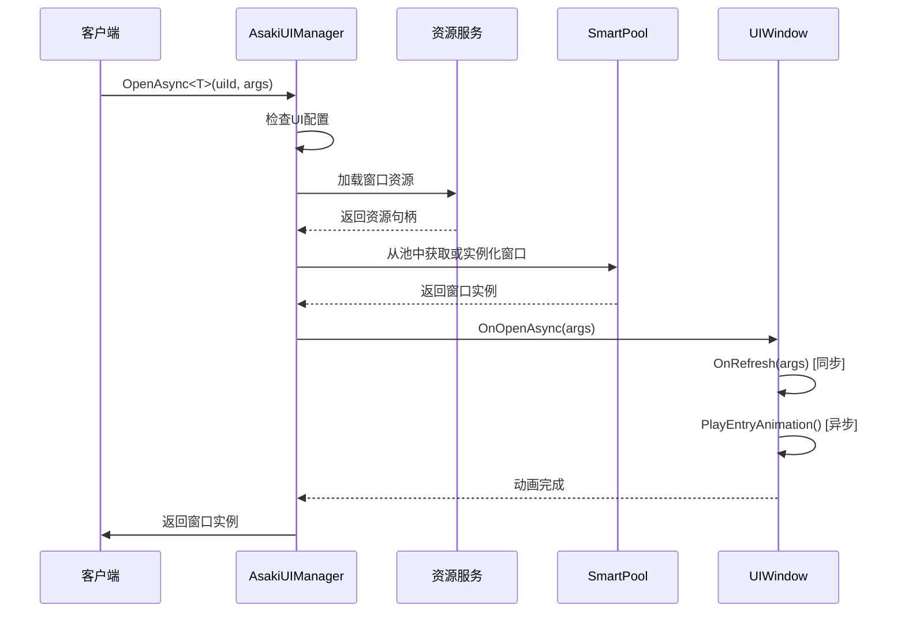
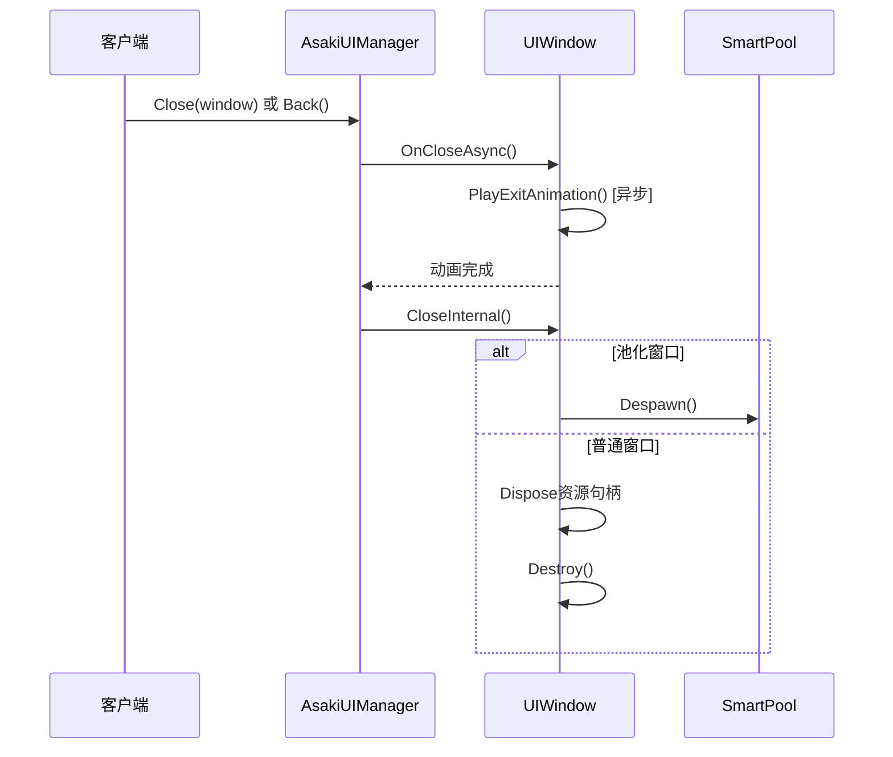

# Asaki框架UI模块技术文档

## 1. 概述

Asaki框架的UI模块是一个功能完整、设计优雅的Unity UI解决方案，采用分层架构设计，支持异步窗口管理、资源池化、数据绑定和完整的窗口生命周期管理。

## 2. 架构设计

### 2.1 分层架构

Asaki UI模块采用分层设计，各层职责明确，便于扩展和维护：

```
┌─────────────────────────────────────────────────────────┐
│                     Editor工具层                         │
│  (AsakiUIGeneratorWindow, AsakiUITools, AsakiUIScaffolder) │
├─────────────────────────────────────────────────────────┤
│                     扩展层                               │
│       (AsakiUIExtensions, 各种Observer)                  │
├─────────────────────────────────────────────────────────┤
│                     配置层                               │
│       (AsakiUIConfig, AsakiUITemplateConfig)             │
├─────────────────────────────────────────────────────────┤
│                     Unity实现层                          │
│   (AsakiUIManager, UIWindow, UIRoot, UIResourceHandleAdapter) │
├─────────────────────────────────────────────────────────┤
│                     核心接口层                           │
│    (IAsakiUIService, IAsakiWindow, IUIResourceHandle)    │
└─────────────────────────────────────────────────────────┘
```

### 2.2 模块集成

UI模块与Asaki框架其他模块紧密集成：

- **ResKit**：实现资源加载和管理
- **SmartPool**：实现UI对象池化
- **Broker**：实现事件分发
- **RoutineKit**：实现异步操作

## 3. 核心类与接口说明

### 3.1 核心接口

#### IAsakiUIService
```csharp
public interface IAsakiUIService : IAsakiModule
{
    Task<T> OpenAsync<T>(int uiId, object args = null, CancellationToken token = default)
        where T : class, IAsakiWindow;
    void Close(IAsakiWindow window);
    void Back();
}
```
- **OpenAsync**：异步打开指定ID的窗口
- **Close**：关闭指定窗口
- **Back**：返回上一个窗口（仅适用于Normal层级）

#### IAsakiWindow
- 窗口基类接口，定义窗口的基本行为和生命周期

#### IUIResourceHandle
- UI资源处理器接口，用于统一资源管理

### 3.2 核心实现类

#### AsakiUIManager
- UI服务的具体实现类，负责窗口的打开、关闭、管理等核心功能
- 维护窗口栈（Normal层级）
- 管理池化资源驻留句柄
- 实现资源池化和非池化两种模式

#### UIWindow
- 窗口基类，实现了IAsakiWindow接口
- 提供完整的窗口生命周期管理
- 支持入场和退场动画
- 实现了对象池化相关接口

#### UIRoot
- UI根节点管理类
- 负责Canvas设置和层级管理
- 提供各层级节点的获取方法

## 4. 关键功能实现流程

### 4.1 窗口打开流程



### 4.2 窗口关闭流程



### 4.3 窗口生命周期

```
OnOpenAsync → OnRefresh → PlayEntryAnimation → OnCover → OnReveal → OnCloseAsync → PlayExitAnimation
```

- **OnOpenAsync**：窗口打开时调用，启动完整的打开流程
- **OnRefresh**：同步刷新窗口数据，子类重写此方法
- **PlayEntryAnimation**：异步播放入场动画，子类重写此方法
- **OnCover**：窗口被其他窗口覆盖时调用
- **OnReveal**：窗口从覆盖状态恢复时调用
- **OnCloseAsync**：窗口关闭时调用，启动完整的关闭流程
- **PlayExitAnimation**：异步播放退场动画，子类重写此方法

## 5. 使用规范

### 5.1 创建窗口

1. 创建继承自UIWindow的窗口类
2. 在Inspector中配置窗口信息
3. 在AsakiUIConfig中注册窗口

### 5.2 打开窗口

```csharp
var uiService = AsakiContext.Get<IAsakiUIService>();
var window = await uiService.OpenAsync<MyWindow>(uiId, args);
```

### 5.3 关闭窗口

```csharp
// 方法1：通过UI服务关闭
uiService.Close(window);

// 方法2：通过窗口自身关闭
window.Close();

// 方法3：返回上一个窗口
uiService.Back();
```

### 5.4 窗口实现示例

```csharp
public class MyWindow : UIWindow
{
    [SerializeField] private Text _titleText;
    [SerializeField] private Button _closeButton;
    
    protected override void Awake()
    {
        base.Awake();
        _closeButton.onClick.AddListener(Close);
    }
    
    protected override void OnRefresh(object args)
    {
        if (args is string title)
        {
            _titleText.text = title;
        }
    }
    
    protected override async Task PlayEntryAnimation(CancellationToken token)
    {
        // 播放入场动画
        await AnimationHelper.PlayFadeIn(CanvasGroup, 0.3f, token);
    }
    
    protected override async Task PlayExitAnimation(CancellationToken token)
    {
        // 播放退场动画
        await AnimationHelper.PlayFadeOut(CanvasGroup, 0.3f, token);
    }
}
```

## 6. 常见问题解决方案

### 6.1 窗口无法打开
- 检查UI配置中是否注册了该窗口ID
- 检查窗口资源路径是否正确
- 检查窗口脚本是否继承自UIWindow

### 6.2 窗口动画不播放
- 确保重写了PlayEntryAnimation或PlayExitAnimation方法
- 确保动画方法返回了正确的Task

### 6.3 窗口资源无法释放
- 确保窗口正确调用了Dispose方法
- 检查池化资源是否正确管理

### 6.4 窗口层级显示异常
- 检查窗口配置中的层级设置
- 确保UIRoot正确初始化

## 7. 性能优化建议

1. **使用对象池化**：对于频繁打开/关闭的窗口，建议启用池化
2. **合理设置资源加载策略**：根据窗口使用频率选择合适的资源加载策略
3. **优化动画性能**：避免复杂的动画效果，使用CanvasGroup控制显示/隐藏
4. **减少DrawCall**：合理使用UI合并和图集
5. **及时释放资源**：确保窗口关闭时正确释放资源

## 8. 编辑器工具

Asaki UI模块提供了一系列Editor工具，辅助UI开发：

- **UI生成器窗口**：快速生成UI代码
- **UI工具类**：提供各种UI编辑工具
- **UI脚手架工具**：快速创建UI结构

## 9. 总结

Asaki框架的UI模块是一个功能完整、设计优雅的Unity UI解决方案，具有以下特点：

- 分层架构设计，便于扩展和维护
- 支持异步窗口管理
- 提供完整的窗口生命周期管理
- 支持资源池化和非池化两种模式
- 集成了MVVM风格的数据绑定
- 提供了丰富的Editor工具
- 与Asaki框架其他模块紧密集成

通过使用Asaki UI模块，开发者可以快速构建高效、可维护的Unity UI系统，提高开发效率和游戏性能。